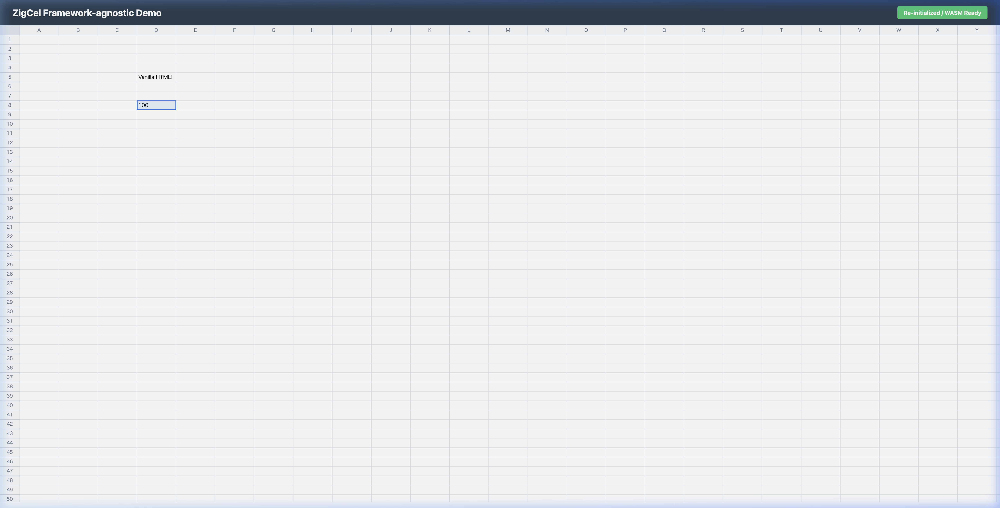

# Step 6: 各環境での動作検証（デモアプリ構築）

## 概要
WASM + Web Components で構築したスプレッドシート（ZigCel）の最大の利点である「フレームワーク非依存（Framework-agnostic）」であることを証明するため、異なる２つのフロントエンド環境（Vanilla HTML, React）でのデモアプリを構築し、組み込みの容易さと計算エンジンの正常動作を検証しました。

## 実装内容と検証

### 1. ライブラリビルドの設定
`vite.config.ts` を修正し、コンポーネントのみを抽出して `zigcel.js` としてESM等でパッケージ化できるようにしました。ユーザーは `mountZigCel()` などのヘルパー関数を呼び出すだけでWASMのフェッチ〜初期化〜コンポーネントへの適用を完了できるように設計しました。

### 2. Vanilla HTMLデモ (`/demo-vanilla/`)
ビルドツールを一切持たない生のHTMLファイル（`index.html`）環境下で、ローカルに配置したJSとWASMを読み込むテストを行いました。

**検証結果:**
- 生のHTML上に `<zig-cel>` をプログラムからマウント成功。
- テキストの入力（"Vanilla HTML!"）と、計算式（`=50+50`）の評価結果（`100`）を正常に描画できることを確認しました。

### 3. React連携デモ (`/demo-react/`)
最新の Vite + React + TypeScript のプロジェクトに、ビルドされたJSとWASMを組み込み、Reactのコンポーネントツリーに `<zig-cel>` を透過的に埋め込む（ネイティブHTMLとして扱う）形でのテストを行いました。

**検証結果:**
- Reactの `useEffect` や `useRef` を介してWeb ComponentsへWASMエンジンを注入する（`mountZigCel`）フローが正常に機能しました。
- テキスト入力（"React App!"）と、計算式（`=250+150`）が `400` として評価され描画されることを確認しました。

## 結論
ZigCelアーキテクチャは、DOMの複雑なデータバインディングやV-DOMを一切介さず、WASM内の1つのシームレスな共有メモリから直接Canvasへピクセルを描画する完全な独立システムとして機能しています。このアーキテクチャにより、いかなる外側のWebフレームワーク（VanillaでもReactでも）に依存せずに超高速なスプレッドシートを提供できることが実証されました。
